# 🌤️ Paperwhite Weather

Turn a used Kindle Paperwhite into a quiet, always-on e-ink home display: time, current
weather, a multi-day forecast, and sun/twilight times, with interchangeable skins. A small
Python service renders the dashboard as a PNG; the jailbroken Kindle only downloads and
displays it.

[](https://github.com/estcarisimo/paperwhite-weather/actions/workflows/ci.yml)
[](pyproject.toml)
[](LICENSE)

> **Status: on the wall, version 0.1.0 (2026-09-20).** The service runs on the
> maintainer's Raspberry Pi with live Open-Meteo data; the Kindle fetches a frame every
> 15 minutes, sleeps between refreshes, and starts the dashboard by itself after a
> reboot. Seven skins; what changed and what is planned are in
> [`CHANGELOG.md`](CHANGELOG.md) and [`docs/ROADMAP.md`](docs/ROADMAP.md).

## ✨ Features

- 🖼️ **Kindle-native rendering**: 1072x1448 grayscale PNG, quantized to the panel's 16 gray levels, landscape (default) or portrait, each with its own layout
- 🎨 **Seven skins on one data model**, from quiet to detailed: `minimal`, `big-clock`, `forecast`, `graphic`, `timeline` (the day hour by hour), `weather-station`, and the serif `newspaper`; each has a portrait and a landscape layout, and all draw from the same snapshot
- 🌡️ **The week on one scale**: each day's low-to-high as a bar on a shared axis, today's bar marked at the current temperature
- 🔌 **Pluggable providers**: Open-Meteo for live data (no API key), a deterministic `mock` provider for development
- 🌤️ **Monochrome icons** drawn with vector primitives, so they scale to any panel and carry no license baggage
- 🌅 **The sun's day as one graphic**: an arc over the horizon from civil dawn to civil dusk, the sun marked where it is now, computed locally from your coordinates
- 🕒 **Honest timestamps**: every frame shows when its data was fetched, so stale data is obvious
- 🧪 **Testable without a Kindle**: the renderer runs anywhere Python runs; CI uploads the rendered frame
- 📡 **LAN service**: `paperwhite serve` publishes `/dashboard/{landscape,portrait}.png` and a `/health` identity on port 8765; a failed fetch keeps the last good frame
- 🔒 **Your location stays local**: configuration is git-ignored and never leaves your network except to the weather provider you choose

## 🚀 Quick Start

```bash
git clone https://github.com/estcarisimo/paperwhite-weather.git
cd paperwhite-weather
uv sync
cp config.example.yaml config.yaml     # edit coordinates, time zone, units, skin
uv run paperwhite render --config config.yaml --output dashboard.png
```

Requirements: Python 3.10 or newer and [uv](https://github.com/astral-sh/uv). The
project is not published to PyPI or any other package index; install from GitHub as above.

## 🖼️ Put it on the wall

You need a machine on your LAN that stays on (a Raspberry Pi will do) and a jailbroken
Kindle. The whole setup is one command on the server and a few file copies on the Kindle.

**1. The server.** On the always-on machine, from the checkout:

```bash
deploy/install.sh
```

That installs a user-level systemd unit that fetches weather every 15 minutes and serves
the frame on port 8765; it creates `config.yaml` and `.env` from the examples if you have
not already, and re-running it after `git pull` is the update. Edit `config.yaml` with
your coordinates and time zone, set `PAPERWHITE_PROVIDER=open-meteo` in `.env`, restart
the unit. [`docs/DEPLOY.md`](docs/DEPLOY.md) has the details, the routes, and how to
check it (`curl http://<server>.lan:8765/health`).

**2. The Kindle.** Jailbreak it first: [`docs/DEVICE.md`](docs/DEVICE.md) has the runbook
that was followed for a Paperwhite 3 on firmware 5.16.2.1.1 (WinterBreak2, then KUAL,
MRPI, and USBNetwork for SSH over Wi-Fi), with the legal note and the update-blocking
step. Then copy the client to the device and tell it your server's hostname: over SSH
(the verified way) or with `kindle/install.sh` over USB (still a draft);
[`kindle/README.md`](kindle/README.md) has both, and what `start` does to the device.
Start the dashboard from KUAL (Paperwhite Weather → Start dashboard). It finds the server
by name, falls back to a subnet scan, paints the frame, and sleeps until the next refresh;
a tap during the awake window switches orientation, and `enable-boot` makes it start on
its own after a restart.

The server hostname is the only thing the two sides share; nothing in the code assumes a
particular machine name.

## 📖 Usage

```bash
# Render one frame with fixture data (no network needed)
uv run paperwhite render --config config.example.yaml --output dashboard.png

# Render with live weather from Open-Meteo
uv run paperwhite render --config config.yaml --provider open-meteo --output dashboard.png

# Pin the clock for reproducible output; the value must carry a UTC offset
uv run paperwhite render -c config.example.yaml -o dashboard.png --now 2026-09-18T21:45:00+00:00

# Try a skin or the other orientation without editing the config
uv run paperwhite render -c config.example.yaml -o dashboard.png --skin newspaper
uv run paperwhite render -c config.example.yaml -o dashboard.png --orientation portrait

# Render every skin in both orientations into a directory
uv run paperwhite gallery -c config.example.yaml -o gallery/

# Serve frames on the LAN (fetches on a schedule, renders on request)
PAPERWHITE_PROVIDER=open-meteo uv run paperwhite serve --config config.yaml --port 8765
curl -s http://localhost:8765/health

# What is available
uv run paperwhite skins
uv run paperwhite providers
uv run paperwhite version
```

## 🔧 Configuration

The service reads `PAPERWHITE_CONFIG`, `PAPERWHITE_PROVIDER`, `PAPERWHITE_HOST`, and
`PAPERWHITE_PORT` from the environment (flags override them); `.env.example` documents them
and the systemd unit loads a git-ignored `.env`. The Kindle client is told the server's
hostname at install time; nothing assumes a particular machine name.

`config.example.yaml` documents every option. Copy it to `config.yaml` (git-ignored):

```yaml
location:
  name: Chicago
  latitude: 41.8781
  longitude: -87.6298
  timezone: America/Chicago

units:
  temperature: fahrenheit  # celsius | fahrenheit
  wind: mph                # kmh | mph | ms

display:
  skin: minimal            # see `paperwhite skins`
  orientation: landscape   # landscape | portrait
  width: 1072              # Kindle Paperwhite 3 native framebuffer
  height: 1448
  time_format: 12h         # 12h | 24h
  refresh_minutes: 15
```

Unknown keys, invalid time zones, and out-of-range coordinates are rejected at load time.

## 🏗️ Architecture

Client-server, with the Kindle as a thin display. The reasoning, the alternatives, and the
open questions are in [`docs/ARCHITECTURE.md`](docs/ARCHITECTURE.md); device facts are in
[`docs/DEVICE.md`](docs/DEVICE.md).

```
src/paperwhite_weather/
├── config.py          # Location, Units, Display, Settings; load_settings(path)
├── models.py          # WeatherSnapshot and friends: the provider-independent data model
├── units.py           # temperature and speed conversions
├── fonts.py           # bundled Inter, Oswald, Playfair Display (SIL OFL), DejaVu Serif (Bitstream Vera)
├── icons.py           # monochrome condition icons drawn with Pillow primitives
├── sun.py             # civil dawn/dusk, sunrise/sunset via astral
├── providers/         # WeatherProvider protocol, mock and Open-Meteo providers, registry
├── skins/             # Skin protocol, Canvas helper, seven skins, registry
├── render.py          # render_dashboard(): compose, rotate, quantize to 16 grays; render_offline()
├── service.py         # DashboardService (cache + per-minute frames) and the HTTP server
└── cli.py             # `paperwhite render | gallery | serve | skins | providers | version`
deploy/
├── install.sh         # one-command setup of the unit on the always-on machine
├── systemd/           # user-level unit for the Raspberry Pi
└── avahi/             # optional mDNS advertisement
kindle/
├── paperwhite.sh      # the client: discover, fetch, paint with eips, sleep, repeat
├── install.sh         # copy the client to a USB-mounted Kindle
└── extensions/        # KUAL menu: start, stop, one frame, toggle, status
```

Deployment on the Pi is documented in [`docs/DEPLOY.md`](docs/DEPLOY.md).

## 🧪 Development

```bash
uv sync
uv run pre-commit install
uv run ruff check src/ tests/
uv run ruff format --check src/ tests/
uv run mypy src/paperwhite_weather
uv run pytest --cov=paperwhite_weather
```

Every change lands through a pull request with green CI and an independent review; see
[`CONTRIBUTING.md`](CONTRIBUTING.md) and [`.github/REVIEW.md`](.github/REVIEW.md).

## 📊 Example Output

```
$ uv run paperwhite render --config config.example.yaml --output dashboard.png --now 2026-09-18T21:45:00+00:00
INFO paperwhite_weather.render: Rendering skin 'minimal' on a 1448x1072 canvas
Rendered skin 'minimal' (landscape, 1072x1448) from 'mock' data fetched at 2026-09-18 21:45 UTC -> dashboard.png

$ uv run paperwhite skins
big-clock
forecast
graphic
minimal
newspaper
timeline
weather-station

$ uv run paperwhite version
paperwhite-weather 0.1.0
```

Every skin rendered from the mock provider at the same instant, landscape as it reads on
the wall (the PNG the Kindle receives is rotated to its portrait framebuffer), then
portrait. `paperwhite gallery` produces all of these; CI uploads them on every run.

| Skin | Landscape | Portrait |
| --- | --- | --- |
| `minimal` (default) | 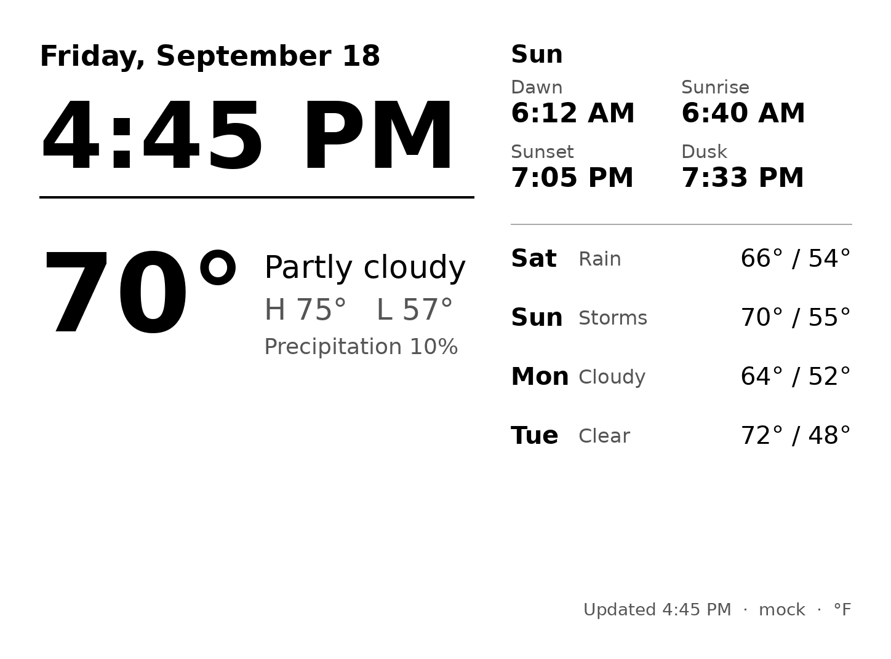 | 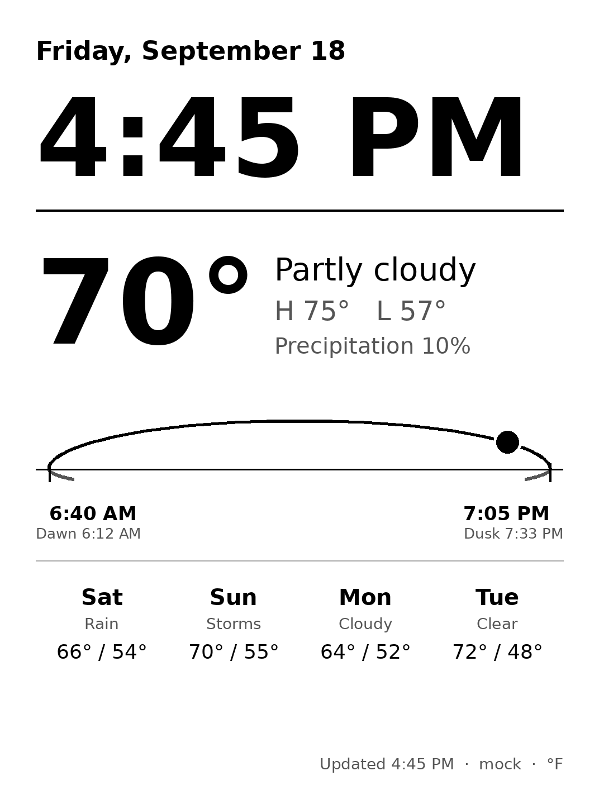 |
| `newspaper` | 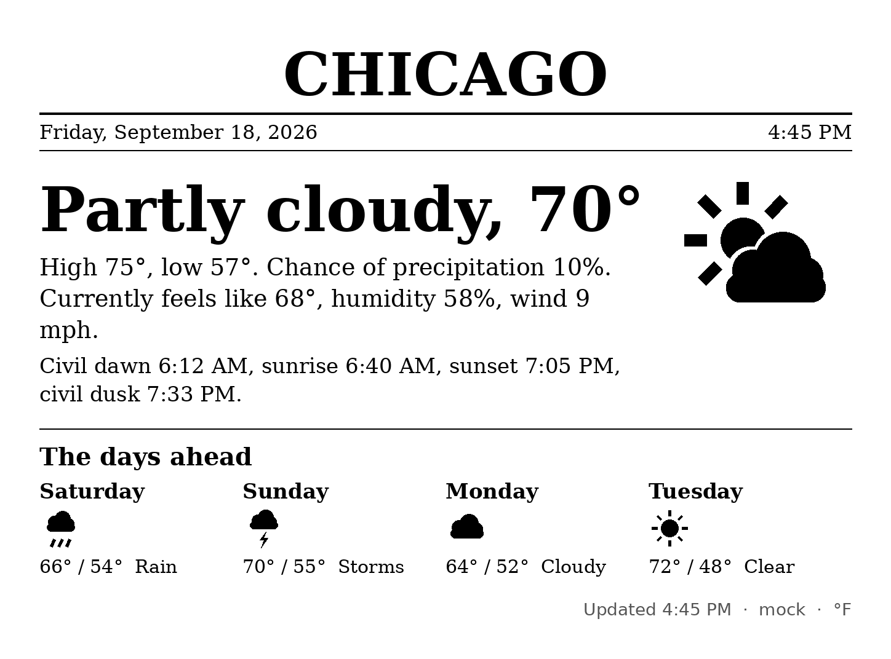 | 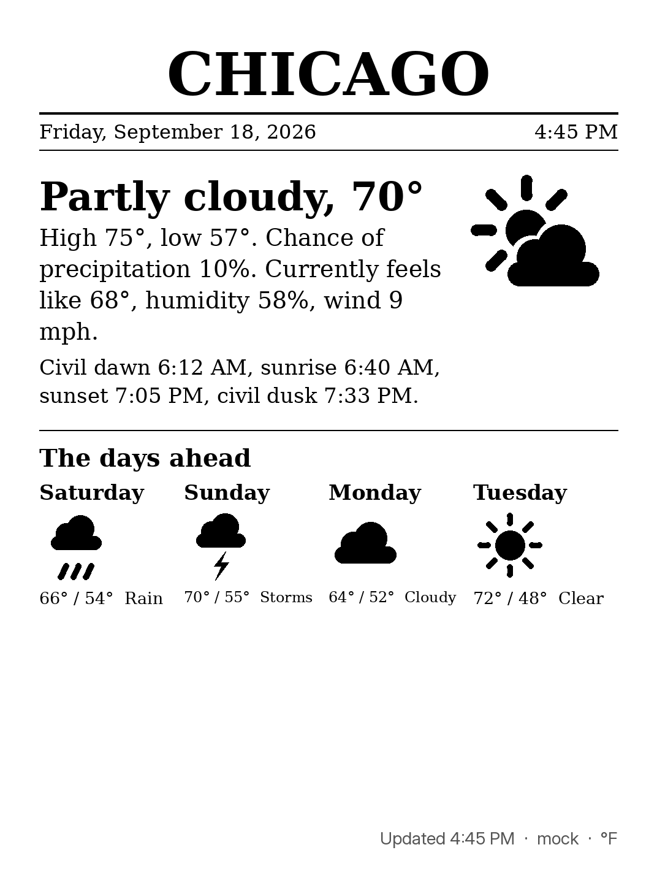 |
| `weather-station` | 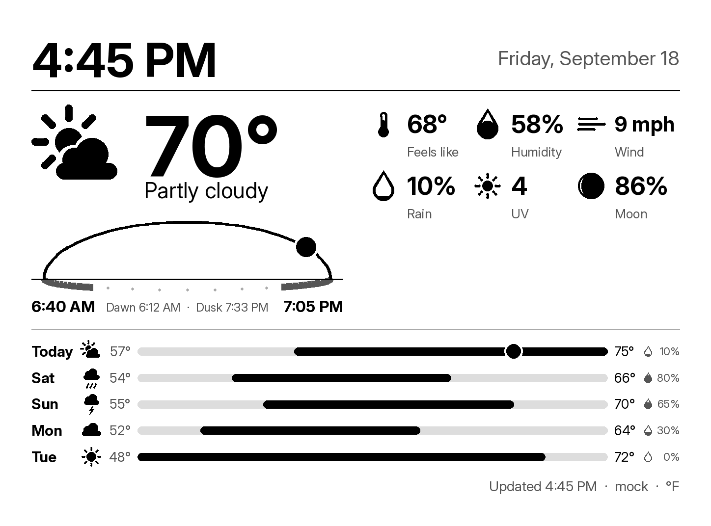 | 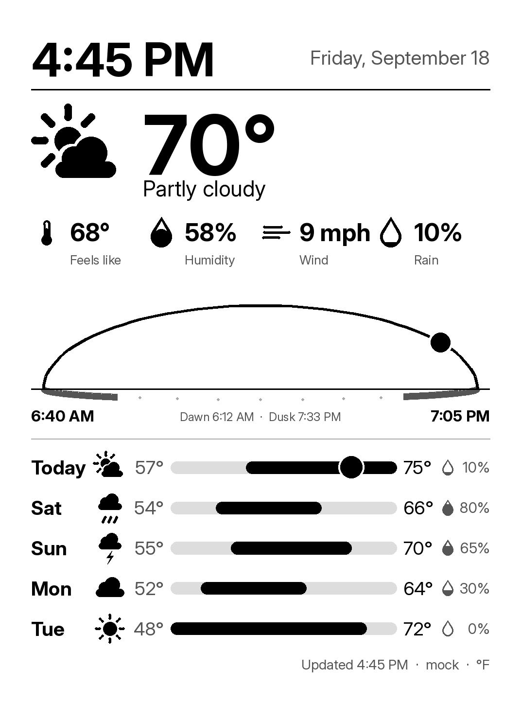 |
| `big-clock` | 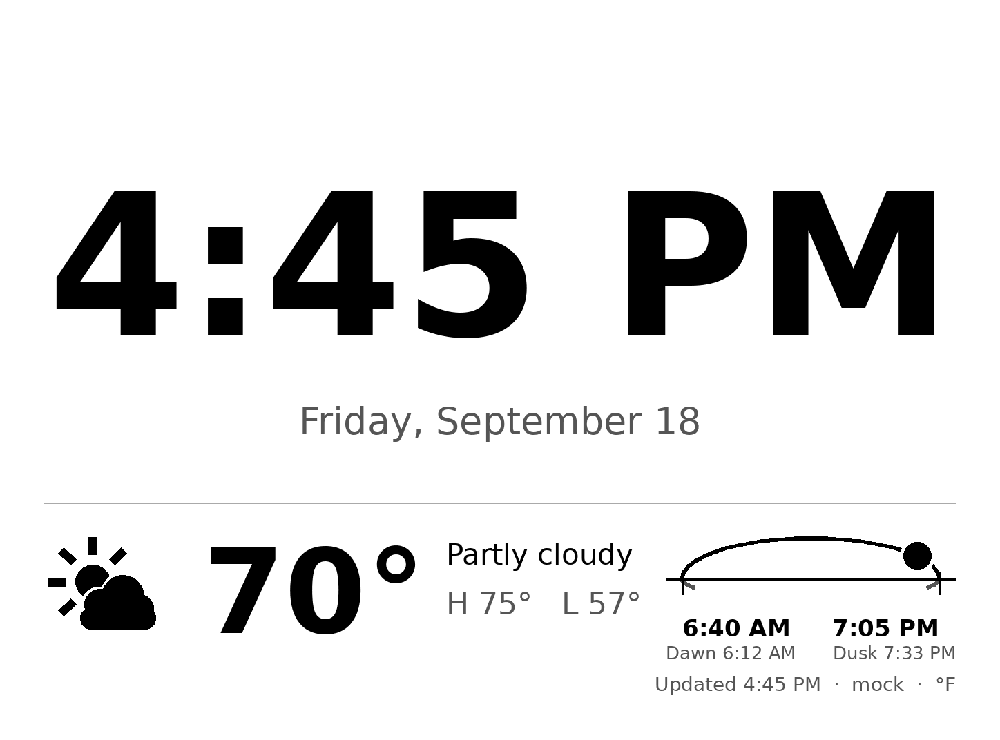 | 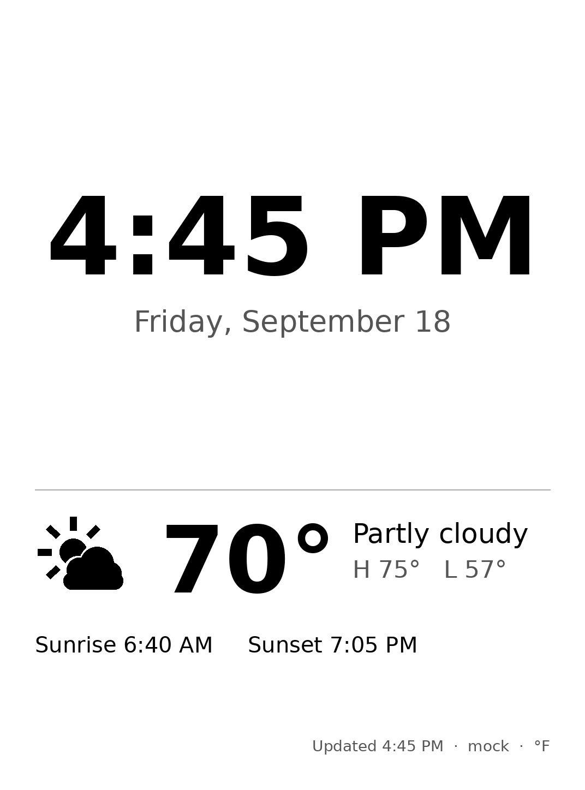 |
| `forecast` | 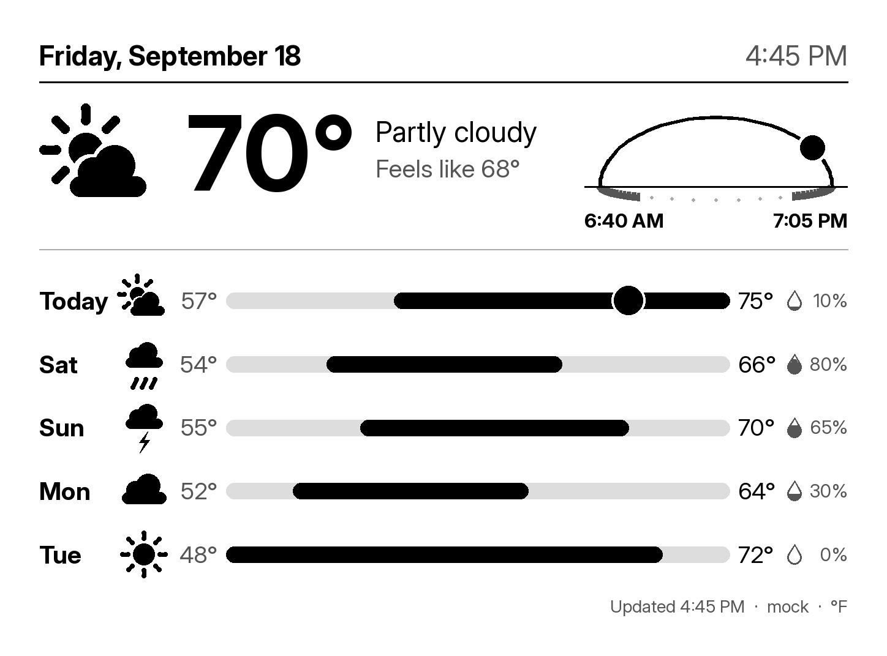 | 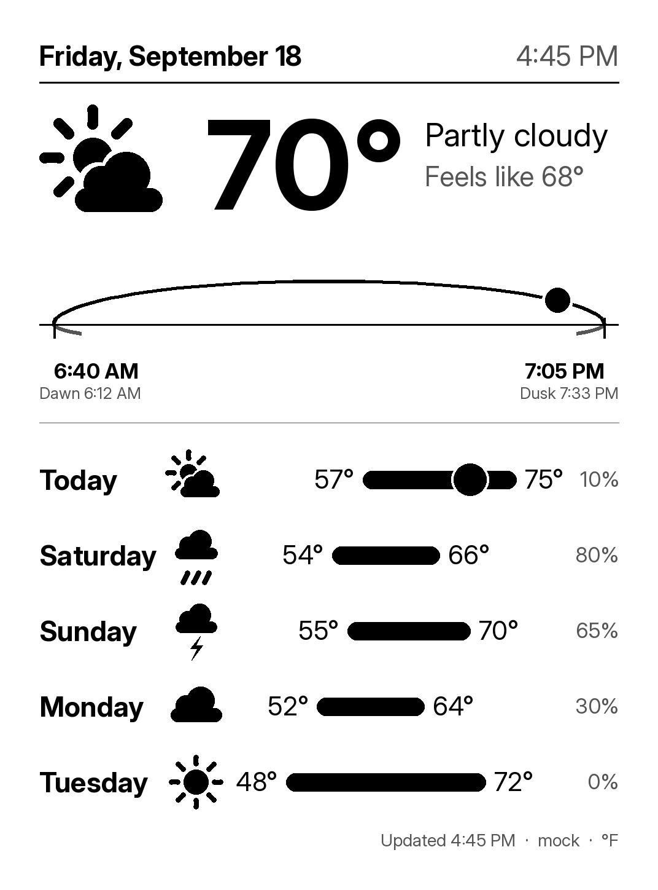 |
| `graphic` | 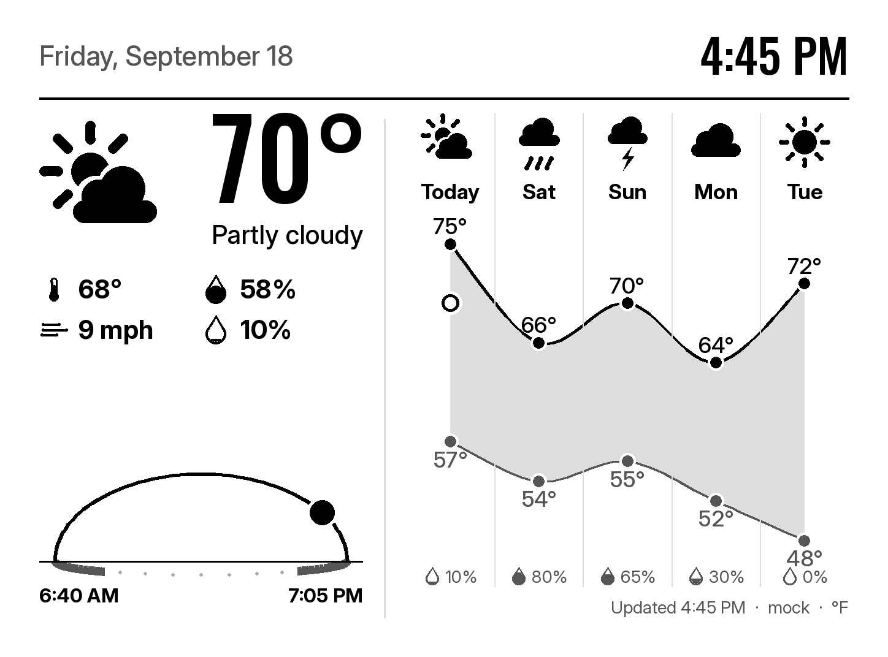 | 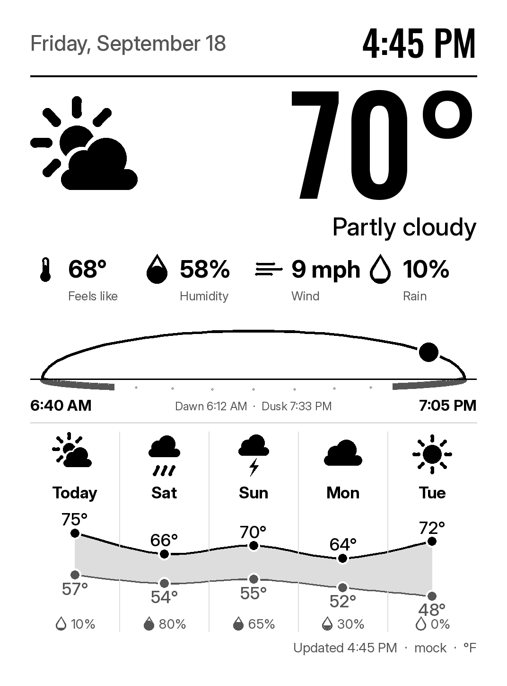 |
| `timeline` | 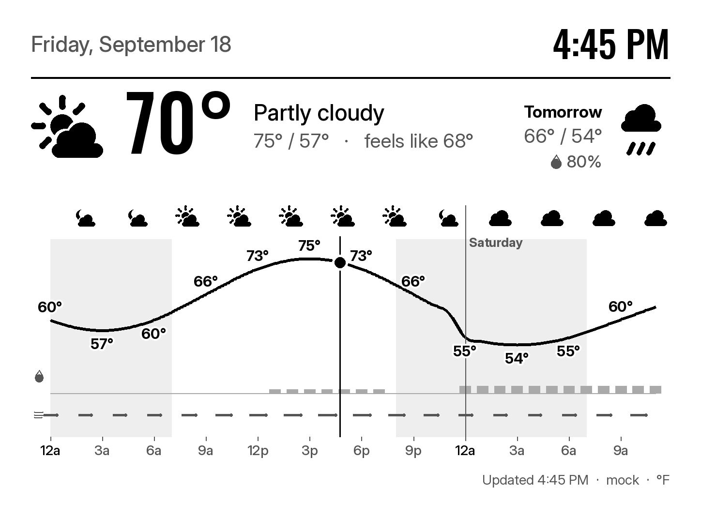 | 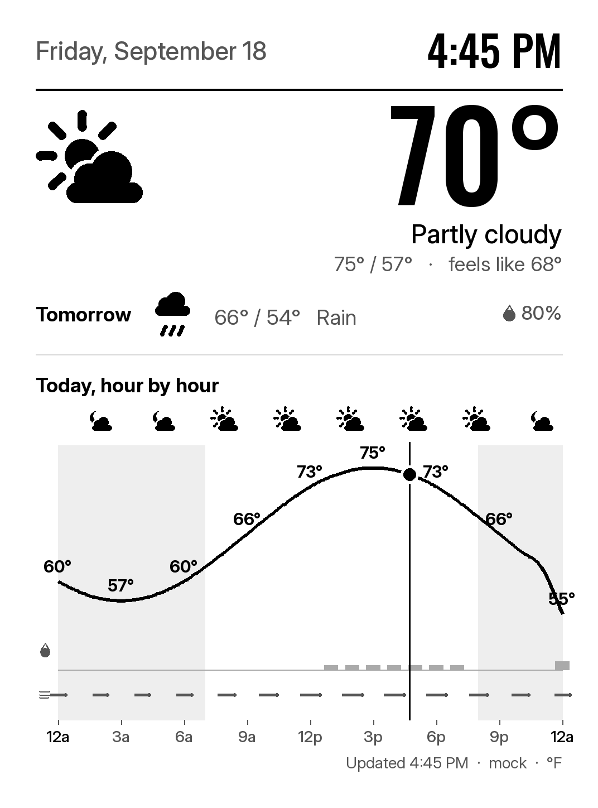 |

## 🗺️ Roadmap

The skins are in their second pass (September 2026), with the direction **fewer words,
more pictures**: Inter and Oswald typefaces, redrawn icons with night variants, the sun
arc, temperature bars on a shared track, and the `graphic` skin's band chart are in;
`minimal` is the quiet end of the range and `timeline` draws the day hour by hour from
the hourly forecast; `weather-station`, `big-clock`, and `newspaper` (which stays
text-first on purpose) had their layout pass last. Next is the maintainer's review of
all seven on the panel. The
full plan, with what is done and what is open, is in [`docs/ROADMAP.md`](docs/ROADMAP.md);
ideas are welcome as issues.

## 🤝 Contributing

Contributions are welcome. Read [`CONTRIBUTING.md`](CONTRIBUTING.md) first, then:

1. Fork the repository
2. Create a branch (`git switch -c feat/my-skin`)
3. Commit your changes with a `CHANGELOG.md` entry
4. Push the branch
5. Open a pull request

## 📄 License

MIT; see [`LICENSE`](LICENSE). The bundled Inter and Oswald fonts are under the SIL Open
Font License 1.1 (`LICENSE-Inter.txt`, `LICENSE-Oswald.txt` next to them), as is the unmodified
Playfair Display variable font (`LICENSE-Playfair.txt`); DejaVu Serif is under the
Bitstream Vera license; see
[`src/paperwhite_weather/assets/fonts/LICENSE-DejaVu.txt`](src/paperwhite_weather/assets/fonts/LICENSE-DejaVu.txt).

## 🔗 Related Resources

Prior art studied for deployment, framebuffer, and refresh ideas. This project is an
original implementation and does not build on any of them.

- [pytatbro/weather-dashboard-kindle](https://github.com/pytatbro/weather-dashboard-kindle)
- [abbymartin/eink-dashboard](https://github.com/abbymartin/eink-dashboard)
- [jefftko/kindle-dashboard](https://github.com/jefftko/kindle-dashboard)
- [HimbeersaftLP/KindleDashboard](https://github.com/HimbeersaftLP/KindleDashboard)
- [Open-Meteo](https://open-meteo.com/), the weather provider (CC BY 4.0 data, free for non-commercial use)
- [astral](https://github.com/sffjunkie/astral), the sun-position library used for civil twilight
- [MobileRead Kindle Developer's Corner](https://www.mobileread.com/forums/forumdisplay.php?f=150), home of the jailbreak tooling

## 🙏 Acknowledgements

The project was prompted by [Ryan Peterman](https://x.com/ryanlpeterman)'s September 2026
post showing a jailbroken Kindle used as a Linux terminal: an old Kindle is a low-power,
high-contrast, Wi-Fi-connected e-ink computer waiting for a job.
