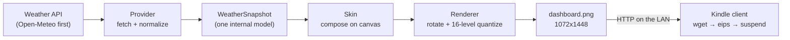

# Architecture

Status: **accepted** by the maintainer on 2026-09-18. This is a decision record; changes
go through a pull request that updates this file.

## Decision: client-server, with the Kindle as a thin display

A small Python service (this package) does all the work; the Kindle does almost none.



| Component | Runs on | Responsibility |
| --- | --- | --- |
| Provider | server | Call one weather API, convert the response to `WeatherSnapshot`, raise on failure |
| Data model | server | `WeatherSnapshot`: current conditions, daily and hourly forecast, sun times, UTC `fetched_at` |
| Skin | server | Draw one frame on a canvas of a given size; several skins share the same data |
| Renderer | server | Pick the skin, handle orientation, quantize to the panel's gray levels |
| Service (`service.py`) | server | Refresh on a schedule, cache the last good snapshot, render frames on request, serve them over HTTP |
| Kindle client (Sprint 3) | Kindle | Wake, join Wi-Fi, download the PNG, write it with `eips`, sleep; a tap switches orientation |

The server is any always-on machine on the same network. The reference deployment is the
maintainer's Raspberry Pi 5, which already hosts other LAN services; nothing in the design
depends on that machine's name.

## Decisions (2026-09-18)

| Decision | Choice | Notes |
| --- | --- | --- |
| Architecture | Client-server as above | Accepted |
| Server | Raspberry Pi on the LAN, plain HTTP | HTTPS on the Kindle's BusyBox `wget` is unreliable; the LAN is the trust boundary |
| Orientation | **Both** rendered on every refresh; **landscape is the default** | The maintainer expects to use it mostly in landscape |
| Switching orientation | A **tap on the screen** toggles between landscape and portrait on the device | The Paperwhite 3 has no accelerometer and no buttons besides power; touch is the only input. Design below, validated in Sprint 1 |
| Discovery | DNS name of the server (`<server>.lan`), configured on the client, with fallbacks | Design and evidence below |
| Skins | Last (Sprint 4), and where most refinement time goes | `minimal` is enough to bring the device up |
| Languages | Python on the server, POSIX shell on the Kindle | See "Language choice" |

### Orientation and the tap gesture

The server renders both orientations from the same snapshot and publishes both:

```
GET /dashboard/landscape.png
GET /dashboard/portrait.png
GET /dashboard.png            → the configured default (display.orientation)
GET /health                   → JSON identity, see Discovery
```

The Kindle keeps one bit of state, its current orientation, in a file on the device. A
tap toggles the bit and refreshes immediately with the other image; the periodic refresh
uses whatever the bit says. The server never needs to know which orientation is on the
wall, and the two images are always consistent because they come from the same render.

Reading the tap: the touch controller is `/dev/input/event1` (`cyttsp4_mt`, verified
2026-09-19). Each event is a 16-byte struct; the client reads with a timeout
(`timeout <s> dd if=/dev/input/event1 bs=16 count=1`) while the device is awake, and any
event counts as a tap. This is deliberately crude: one gesture, one action. Verified: the
raw events reach a script while the stock GUI is running. Still open: whether the device
can stay awake long enough to be tapped (Sprint 3).

### Discovery: how the Kindle finds the Pi

Verified on this network on 2026-09-18 from the Pi:

| Fact | Evidence |
| --- | --- |
| The router (`192.168.86.1`, the DHCP server and DNS resolver) resolves DHCP client hostnames under `.lan` | `getent hosts smokingpi.lan` → `192.168.86.27`; `/etc/resolv.conf` has `search lan` |
| The Pi runs Avahi (mDNS) as well | `systemctl is-active avahi-daemon` → `active` |
| Port `8080` is taken on the Pi by another service | `ss -ltn`; Docker publishes `8080`, `3000`, `8086`, `80` |

Because the Kindle gets its DNS server from the same router, `http://<server>.lan:8765/`
resolves on the device with no mDNS support needed, where `<server>` is whatever the
server machine's hostname is (`smokingpi` in the reference deployment). **Verified from
the Kindle on 2026-09-19**: `wget -q -O - http://smokingpi.lan:8765/health` over SSH
returned the service identity, and `/dashboard.png` fetched the same way was painted
with `eips`. The
service listens on **port 8765** by default (`PAPERWHITE_PORT` or `--port` to change).

The server's name is **client configuration**, never a constant in code or a default in
the design. The Kindle client reads `SERVER_HOST` (and optionally `SERVER_PORT`) from its
config file, written by the install script from the value the person supplies; the
environment variable `PAPERWHITE_SERVER` overrides it for one run. Resolution order, stopping
at the first `/health` that answers with the expected identity:

1. `SERVER_URL` from the client's config file, if set (any URL, no discovery).
2. `http://$SERVER_HOST.lan:$SERVER_PORT`.
3. `http://$SERVER_HOST.local:$SERVER_PORT` (works only where the resolver does mDNS).
4. A scan of the default gateway's `/24` for `/health` with a one-second timeout per
   host, in parallel batches. Slow (tens of seconds) but needs no configuration at all,
   so a client with no `SERVER_HOST` still finds the server.

`/health` returns `{"service": "paperwhite-weather", "version": "...", "hostname": "...",
"fetched_at": "...", "orientations": ["landscape", "portrait"], ...}` so the scan can tell
this service from any other web server on the LAN, and a client that found the server by
scanning learns its hostname for next time. The Pi also advertises `_paperwhite-weather._tcp` through
Avahi for clients that can browse mDNS; the Kindle probably cannot, so this is for tooling.

A DHCP reservation for the Pi on the router is recommended but not required: the name
survives an address change, the scan survives a name change.

### Why this shape

- **The Kindle is a poor place to run code.** The Paperwhite 3 has a 2011-era ARM core,
  a limited BusyBox userland, and an experimental browser. Everything that needs a modern
  language runtime, TLS, or fonts is easier, faster, and testable on a normal computer.
- **Testable without hardware.** The renderer produces a PNG; tests assert size, mode,
  gray levels, and determinism, and CI uploads the rendered frame as an artifact. A
  contributor can work on a skin with no Kindle at all.
- **Battery.** The Kindle only needs Wi-Fi on for a few seconds per refresh. Doing work on
  the device keeps the CPU and radio awake longer.
- **Skins are cheap.** Because skins consume one normalized model, adding a layout does
  not touch the provider, and swapping the provider does not touch any skin.

### Alternatives considered

1. **Kindle-only.** Fetch the API from a shell script on the device and draw with the
   framebuffer tools. Rejected for now: no image library or font rendering on the device
   beyond what `eips` offers, and the script would be untestable off-device.
2. **Kindle browser kiosk.** Point the built-in browser at a web page. Rejected: the
   browser is slow, does not survive sleep well, and its rendering is not under our
   control.
3. **Static hosting instead of a LAN server.** A scheduled job (GitHub Actions cron, or a
   cron on any machine) renders the PNG and publishes it to a static host; the Kindle
   fetches a public URL. Kept as a **supported deployment variant** for people without an
   always-on machine at home; the renderer is a CLI precisely so it can run anywhere. The
   LAN service remains the reference because it keeps the location off the public internet.

## Language choice: Python on the server, POSIX shell on the Kindle

"Repurposing the Kindle" means jailbreaking it and running scripts as root on its stock
Linux, not replacing its operating system. Native code (C or Rust cross-compiled for the
device's ARMv7 and old glibc) is only needed to talk to the e-ink controller, and that
tool already exists: the stock `eips` binary, or NiLuJe's FBInk. Every Kindle dashboard
project reviewed as prior art follows the same split (checked 2026-09-18 with
`gh api repos/<repo>/languages`):

| Project | Server side | Kindle side |
| --- | --- | --- |
| pytatbro/weather-dashboard-kindle | Python (Flask) renders the page | shell script |
| abbymartin/eink-dashboard | Python renders SVG → PNG | shell script |
| jefftko/kindle-dashboard | none (a Node example data server) | POSIX shell + FBInk binary |
| HimbeersaftLP/KindleDashboard | none | web page in the Kindle browser |

So: the rendering service is Python (Pillow for drawing, Pydantic for the data model, Typer
for the CLI), and `kindle/` will hold POSIX shell for BusyBox `ash`, checked with
ShellCheck in CI from Sprint 3. Writing our own native display code is out of scope unless
`eips` and FBInk both prove insufficient on the device.

## Data flow details

- **Units are decided once.** The provider is asked for the configured units and the
  snapshot carries them; skins never convert.
- **Time.** Every `datetime` is timezone-aware. `fetched_at` is UTC; skins convert to the
  location's zone when formatting. The clock shown is the render time, so a minute-accurate
  clock requires a render per minute (see open questions).
- **Failure.** Providers raise. The service (Sprint 2) keeps the last good snapshot and
  renders it with a visible "Updated HH:MM" so stale data is obvious rather than silently
  wrong. An "offline" frame is shown only if there has never been a good snapshot.
- **Orientation.** Skins compose on `Display.canvas_size`; in landscape that is
  1448x1072 and the renderer rotates the result back to the native 1072x1448 framebuffer.

## Kindle side (design; the client script is Sprint 3)

`kindle/paperwhite.sh`, started from KUAL or over SSH, stops the stock GUI, disables the
screensaver and frontlight, and loops:

1. Discover the server (see below) and `wget` the PNG for the current orientation; on
   failure keep the cached copy.
2. `eips -c` every N refreshes to fight ghosting, then `eips -g` to paint the frame.
3. Wait `REFRESH_MINUTES`, reading the touch device meanwhile; a tap toggles the
   orientation and repaints at once.

4. Stay awake `AWAKE_SECONDS` for taps, then set the RTC alarm for the next refresh and
   suspend; on resume, wait for Wi-Fi and go to step 1.

Verified on the device on 2026-09-19 (`docs/DEVICE.md`). Awake with Wi-Fi on cost
1.3 %/hour, so suspend is the default.

## Open questions and current recommendations

| Question | Recommendation | Why |
| --- | --- | --- |
| Live clock every minute vs. ambient refresh | Ambient: one refresh per `refresh_minutes` (15), device suspended in between; the clock shows the refresh time | Awake with Wi-Fi costs 1.3 %/h (measured); a minute clock would keep the device awake |
| Pillow vs. HTML/CSS + headless browser | Pillow | No browser dependency on a Raspberry Pi, deterministic, fast; revisit if a skin needs layout features Pillow cannot do |
| Where the service runs | Raspberry Pi on the LAN; static-hosting variant documented | Keeps location private, no cloud account needed |
| Portrait vs. landscape | Landscape default, both served on every refresh, a tap toggles on the device (decided 2026-09-18) | Reads as a wall panel; the framebuffer is portrait, so `render.py` rotates the landscape canvas |
| Default skin | `minimal` | Smallest surface to get right first |
| Weather provider | Open-Meteo (done) | No API key for non-commercial use; sun times and civil twilight computed locally with `astral` |
| Project name | Paperwhite Weather | Already used for the repository and Notion page |
