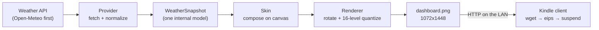

# Architecture

Status: **proposed** (2026-09-18). This is the decision the foundation is built on; it is
open for discussion until Sprint 1 starts, and then it is a decision record.

## Decision: client-server, with the Kindle as a thin display

A small Python service (this package) does all the work; the Kindle does almost none.

| Component | Runs on | Responsibility |
| --- | --- | --- |
| Provider | server | Call one weather API, convert the response to `WeatherSnapshot`, raise on failure |
| Data model | server | `WeatherSnapshot`: current conditions, daily forecast, sun times, UTC `fetched_at` |
| Skin | server | Draw one frame on a canvas of a given size; several skins share the same data |
| Renderer | server | Pick the skin, handle orientation, quantize to the panel's gray levels |
| Service (Sprint 2) | server | Refresh on a schedule, cache the last good snapshot, serve the PNG over HTTP |
| Kindle client (Sprint 3) | Kindle | Wake, join Wi-Fi, download the PNG, write it with `eips`, sleep |

The "server" is any always-on machine on the same network. The reference deployment is
the Raspberry Pi 5 that already hosts this repository's development environment.

### Why this shape

- **The Kindle is a poor place to run code.** The Paperwhite 3 has a 2011-era ARM core,
  a limited BusyBox userland, and an experimental browser. Everything that needs a modern
  language runtime, TLS, or fonts is easier, faster, and testable on a normal computer.
- **Testable without hardware.** The renderer produces a PNG; tests assert size, mode,
  gray levels, and determinism, and CI uploads the rendered frame as an artifact. A
  contributor can work on a skin with no Kindle at all.
- **Battery.** The Kindle only needs Wi-Fi on for a few seconds per refresh. Doing work on
  the device keeps the CPU and radio awake longer.
- **Skins are cheap.** Because skins consume one normalized model, adding a layout does
  not touch the provider, and swapping the provider does not touch any skin.

### Alternatives considered

1. **Kindle-only.** Fetch the API from a shell script on the device and draw with the
   framebuffer tools. Rejected for now: no image library or font rendering on the device
   beyond what `eips` offers, and the script would be untestable off-device.
2. **Kindle browser kiosk.** Point the built-in browser at a web page. Rejected: the
   browser is slow, does not survive sleep well, and its rendering is not under our
   control.
3. **Static hosting instead of a LAN server.** A scheduled job (GitHub Actions cron, or a
   cron on any machine) renders the PNG and publishes it to a static host; the Kindle
   fetches a public URL. Kept as a **supported deployment variant** for people without an
   always-on machine at home; the renderer is a CLI precisely so it can run anywhere. The
   LAN service remains the reference because it keeps the location off the public internet.

## Language choice: Python on the server, POSIX shell on the Kindle

"Repurposing the Kindle" means jailbreaking it and running scripts as root on its stock
Linux, not replacing its operating system. Native code (C or Rust cross-compiled for the
device's ARMv7 and old glibc) is only needed to talk to the e-ink controller, and that
tool already exists: the stock `eips` binary, or NiLuJe's FBInk. Every Kindle dashboard
project reviewed as prior art follows the same split (checked 2026-09-18 with
`gh api repos/<repo>/languages`):

| Project | Server side | Kindle side |
| --- | --- | --- |
| pytatbro/weather-dashboard-kindle | Python (Flask) renders the page | shell script |
| abbymartin/eink-dashboard | Python renders SVG → PNG | shell script |
| jefftko/kindle-dashboard | none (a Node example data server) | POSIX shell + FBInk binary |
| HimbeersaftLP/KindleDashboard | none | web page in the Kindle browser |

So: the rendering service is Python (Pillow for drawing, Pydantic for the data model, Typer
for the CLI), and `kindle/` will hold POSIX shell for BusyBox `ash`, checked with
ShellCheck in CI from Sprint 3. Writing our own native display code is out of scope unless
`eips` and FBInk both prove insufficient on the device.

## Data flow details

- **Units are decided once.** The provider is asked for the configured units and the
  snapshot carries them; skins never convert.
- **Time.** Every `datetime` is timezone-aware. `fetched_at` is UTC; skins convert to the
  location's zone when formatting. The clock shown is the render time, so a minute-accurate
  clock requires a render per minute (see open questions).
- **Failure.** Providers raise. The service (Sprint 2) keeps the last good snapshot and
  renders it with a visible "Updated HH:MM" so stale data is obvious rather than silently
  wrong. An "offline" frame is shown only if there has never been a good snapshot.
- **Orientation.** Skins compose on `Display.canvas_size`; in landscape that is
  1448x1072 and the renderer rotates the result back to the native 1072x1448 framebuffer.

## Kindle side (design, to be validated in Sprint 1)

A shell script started from KUAL (the jailbreak launcher) loops:

1. Ensure Wi-Fi is up; `wget` the PNG from the service (fall back to the cached copy on
   failure).
2. `eips -c` (optional full clear to fight ghosting, every N refreshes) then `eips -g
   dashboard.png` to paint the frame.
3. Schedule an RTC wake-up for `refresh_minutes` later and suspend.

Whether the device can be suspended and woken by RTC reliably on this firmware, and how
long Wi-Fi takes to reconnect, are the main unknowns; `docs/DEVICE.md` tracks them.

## Open questions and current recommendations

| Question | Recommendation | Why |
| --- | --- | --- |
| Live clock every minute vs. ambient refresh | Start with one refresh per `refresh_minutes` (15) showing the render time; measure battery in Sprint 3 before deciding | Minute refreshes multiply wake-ups and panel writes by 15 |
| Pillow vs. HTML/CSS + headless browser | Pillow | No browser dependency on a Raspberry Pi, deterministic, fast; revisit if a skin needs layout features Pillow cannot do |
| Where the service runs | Raspberry Pi on the LAN; static-hosting variant documented | Keeps location private, no cloud account needed |
| Portrait vs. landscape | Portrait default, landscape supported by configuration | Matches the device's native framebuffer; either works on the wall |
| Default skin | `minimal` | Smallest surface to get right first |
| Weather provider | Open-Meteo | No API key for non-commercial use, includes daily sunrise/sunset; civil twilight computed locally |
| Project name | Paperwhite Weather | Already used for the repository and Notion page |
