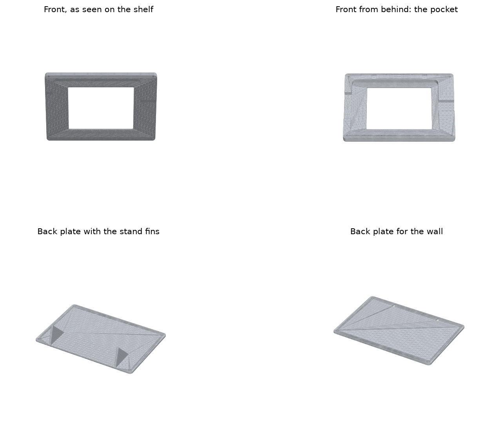
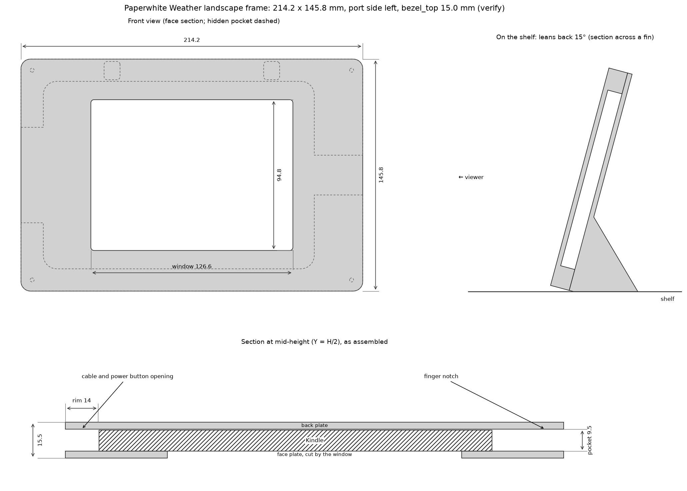

# 🖼️ Landscape picture frame for the Kindle (3D print)

A two-part printed frame that holds the Kindle Paperwhite 3 sideways, like a landscape
photo on a shelf, with the dashboard showing through a window and the cable leaving
through the side. Everything is generated from one Python file; every dimension is a
parameter, so the frame can be adapted to another Kindle or another look.





## The parts

| File (`stl/`) | What it is | Print orientation | Approx. material |
|---|---|---|---|
| `fit-test.stl` | One corner of the front part. Print it first: the Kindle's corner must slide in and out with a little play. | face down, as exported | 20 g, ~15 min |
| `frame-front.stl` | The face with the window and the pocket the Kindle drops into from behind. Openings in the short walls: 60 mm on the port side for the micro-USB cable and the power button, 25 mm opposite to lift the Kindle out. | face down, as exported | 150 g, ~4 h |
| `frame-back-stand.stl` | Back plate with two fins so the frame leans back 15° on a shelf or desk. | flat, fins up, as exported | 100 g, ~3 h |
| `frame-back-wall.stl` | Flat back plate with two keyholes 100 mm apart to hang the frame on two screws. | flat, as exported | 95 g, ~2.5 h |

Print the front and **one** back plate. Both back plates share the same screw holes, so
you can print the other later. Material estimates are for solid volume in PLA; with the
infill below the real numbers are lower.

Also needed: four **M3 x 8 mm** screws (pan or socket head). They cut their own thread
into the printed holes in the front part. No inserts, no glue.

Frame outline: **214 x 146 mm**, 15.5 mm thick (the stand's fins add 40 mm behind).
The window is centered in the frame; because the Kindle's bottom bezel is wider than its
top one, the rim is wider on the side opposite the ports.

## Before printing: three things to check on your Kindle

The Kindle's outer size is well documented (169 x 117 x 9.1 mm). The position of the
display inside it is not, and the window is placed from it. Measure with a ruler and
change the defaults if they differ by more than a millimeter:

1. **`bezel_top`**: from the top edge of the Kindle (held in portrait) to the top edge of
   the lit display area. Default 15.0 mm. The bottom bezel (the wide one with the logo)
   is derived from it, the side bezels from the width.
2. **`device_corner_radius`**: radius of the Kindle's corners. Default 8 mm. Only the
   fit-test print really cares.
3. **`port_side`**: the frame has a 60 mm opening in one short wall for the cable and the
   power button. The dashboard is rotated so the top of the picture is on the Kindle's
   portrait *left* edge (`render.py` turns the landscape canvas 90° counterclockwise),
   which puts the port edge on the **left** when the picture is upright; that is the
   default. If your Kindle ends up the other way round, generate with
   `-s port_side=right`, or simply mirror every part in the slicer.

The defaults with `bezel_top=15.0` give a window 2 mm larger than the display on every
side, so an error of up to 2 mm in the bezel shows a sliver of the Kindle's bezel rather
than cutting into the picture.

## Generating the files

The generator is a single script with its dependencies declared inline, so `uv` sets up
everything on the first run:

```bash
uv run hardware/frame/frame.py dimensions                       # derived sizes, no build
uv run hardware/frame/frame.py build                            # STLs into hardware/frame/stl
uv run hardware/frame/frame.py build -s bezel_top=14.2 -s port_side=right
uv run hardware/frame/frame.py build --preview docs/img/frame-preview.png --drawing docs/img/frame-drawing.png
```

`-s field=value` overrides any field of `FrameSpec` in `frame.py`; the docstring there
explains each one. The generator refuses combinations that would not print or assemble
(a rim too narrow for the keyholes, a fin that overhangs more than 50°, and so on).

Useful knobs:

| Field | Default | Why you would change it |
|---|---|---|
| `rim` | 14 | Narrower rim, smaller frame. 13 mm is the minimum for the keyholes. |
| `center_window` | true | `false` keeps the rim equal on all sides (the window then sits 8 mm off center); the frame shrinks to 198 x 146 mm. |
| `wall_keyholes` | true | `false` drops the keyholes, which lets `rim` go below 13.2 mm. |
| `screw_inset` | 7 | Distance of the screws from the corner; keep it between 4.75 and `rim` minus 3.25. |
| `clearance` | 0.4 | The fit test is tight: raise to 0.5. Loose: lower to 0.3. |
| `lean_angle_deg` | 15 | How far the stand leans back. |
| `window_margin` | 2 | How much of the Kindle's bezel shows around the picture. |
| `outer_corner_radius` | 6 | The frame's corners. |

## Printing it, if this is your first print

**Getting it printed.** You do not need to own a printer. Public libraries and
makerspaces often print for the cost of material; online services (search for
"3D printing service", upload the STL, pick PLA) ship a finished part for a few tens of
dollars. If you buy a printer, check the bed: the frame is 214 x 146 mm, so a bed of
**220 x 220 mm or larger** is needed. An A1 mini or similar 180 mm bed only fits the
small variant, 190 x 138 mm:

```bash
uv run hardware/frame/frame.py build -s center_window=false -s rim=10 -s screw_inset=6 -s wall_keyholes=false
```

**Material.** PLA. It is the easiest material, stiff, and the frame never gets warm.
PETG works too and tolerates a sunny windowsill better; ABS is not needed. Any color; a
matte filament hides layer lines and suits a picture frame.

**Slicer settings** (Bambu Studio, PrusaSlicer, Cura, all fine):

- Layer height 0.2 mm, nozzle 0.4 mm.
- Walls: 3 perimeters. Top and bottom: 4 layers. Infill 20 % (gyroid or grid).
- **Supports: off.** Every part is designed to print flat without them.
- **Brim**: on, 5 mm, for the front part and the back plates. They are large and flat
  and a brim keeps the corners from lifting. Cut it off with a knife afterwards.
- Orientation: leave the parts as they load. The front prints face down so the visible
  side is the smooth first layer; use a textured bed sheet if you have one, it looks
  good. The back plates print with their inner face down and the fins pointing up.
- If the slicer offers "elephant foot compensation", 0.1–0.2 mm keeps the first layer
  from bulging into the window edge.

**Order.** Print `fit-test.stl` first (a quarter of an hour). The Kindle's corner should
slide into the pocket with a little play and the wall should stand about 0.4 mm proud of
the Kindle's back. Too tight: rebuild with `-s clearance=0.5`. Loose enough to rattle:
`-s clearance=0.3`. Then print the front and one back plate.

## Assembly

1. Lay the front face down on a towel. Drop the Kindle into the pocket from behind, screen
   toward the face, ports toward the wall opening.
2. Plug the micro-USB cable in through the side opening. The power button is reachable
   through the same opening with a fingernail.
3. Put the back plate on (fins or keyholes toward you, counterbores out) and drive the
   four M3 x 8 screws in by hand. Stop when the plate sits flat; do not force them.
4. Stand it up. The frame rests on its bottom edge and the two fins; the cable leaves to
   the side. With the wall plate, put two screws 100 mm apart in the wall, leave the
   heads 4 mm proud, and hang the frame on them.

To take the Kindle out: unscrew the plate and lift the Kindle by its edge through the
finger notch opposite the cable.

## Design notes

- The Kindle sits behind a 3 mm face; the window overlaps its bezel by 11 mm on each
  side, so the Kindle cannot fall forward, and the back plate keeps it from falling out
  backward. Nothing presses on the display.
- The stand's fin profile is computed so its foot line and the frame's bottom edge lie
  on the same plane when the frame leans back; the sloped edge of the fin stays under
  45° so it prints without supports.
- The screws cut their own thread in 2.5 mm holes, the usual trick for M3 in PLA. Eight
  millimeters of screw leave five in the front part.
- The keyholes sit in the top rim over pockets milled into the front part, so the screw
  heads never touch the Kindle.
